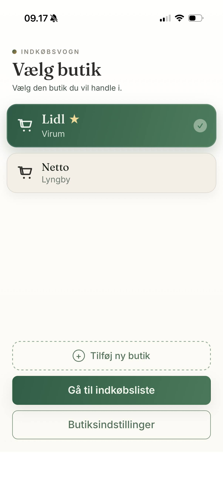
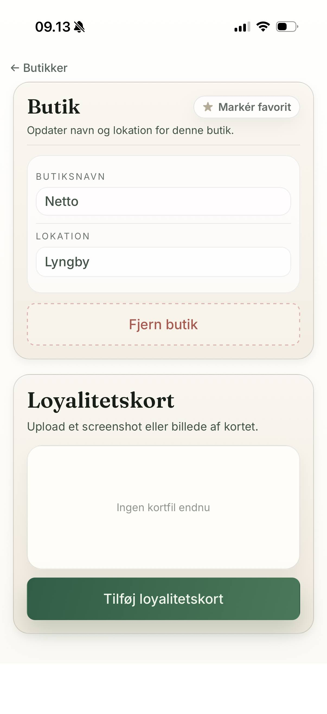
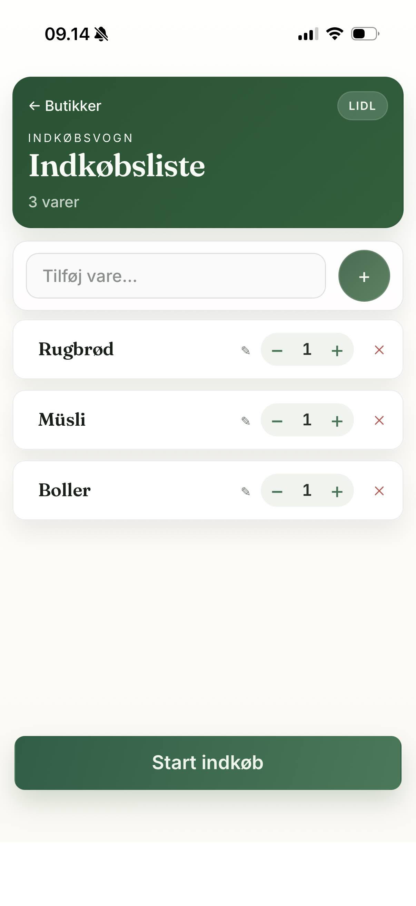

# Indkøbsvogn

A shopping list app that learns the route you actually walk through the store.

> **Status:** Finished and in weekly use. Does exactly what it was built to do.

> **Note:** The app interface is in Danish only.

---

## Background

Most shopping apps are glorified to-do lists. I wanted one that sorts my list by the route I actually walk through the store — and keeps the active trip local on the phone while the shared household data stays in sync.

It's designed for a single household with multiple phones. The active shopping trip lives locally on your device. Stores, items, and completed trips sync in the background when connected.

---

## Features

**Route learning**  
Indkøbsvogn tracks the order you check off items. After a few trips, your list is automatically sorted to match the route you actually walk through the store.

**Favourite stores**  
Create stores and mark favourites — they float to the top. Easy to toggle on and off.

**Offline-first during shopping**  
While you're in the store, the app works without a network connection. Data syncs when you're done.

**Household sharing**  
Login via magic links — no passwords. Everyone in the household shares the same stores and item lists. The active trip belongs to whichever phone is currently shopping.

**Per-store loyalty cards**  
Save your Coop card to Coop, your Lidl card to Lidl. They appear automatically when you're in the right store.

## Screenshots

| Store | Settings | Planning |
|---|---|---|
|  |  |  |

---

## Stack

| Layer | Technology |
|-------|------------|
| Frontend | React 19 + TypeScript + Vite |
| Styling | Plain CSS |
| Backend | Hono API |
| Storage | SQLite-backed persistence |
| Auth | Magic links via Resend |

---

## Getting Started

```bash
bun install
bun run dev
```

Open `http://localhost:8788`.

Copy `.env.example` to `.env` and `.dev.vars.example` to `.dev.vars`. The latter requires a [Resend](https://resend.com) API key for local magic link delivery.

---

## Build and test

```bash
bun run build
bun run test
bun run preview
```

---

## Notes

- The app is intended for one household at a time.
- The active shopping trip stays local on the current device.
- Shared household data is synchronized in the background.
