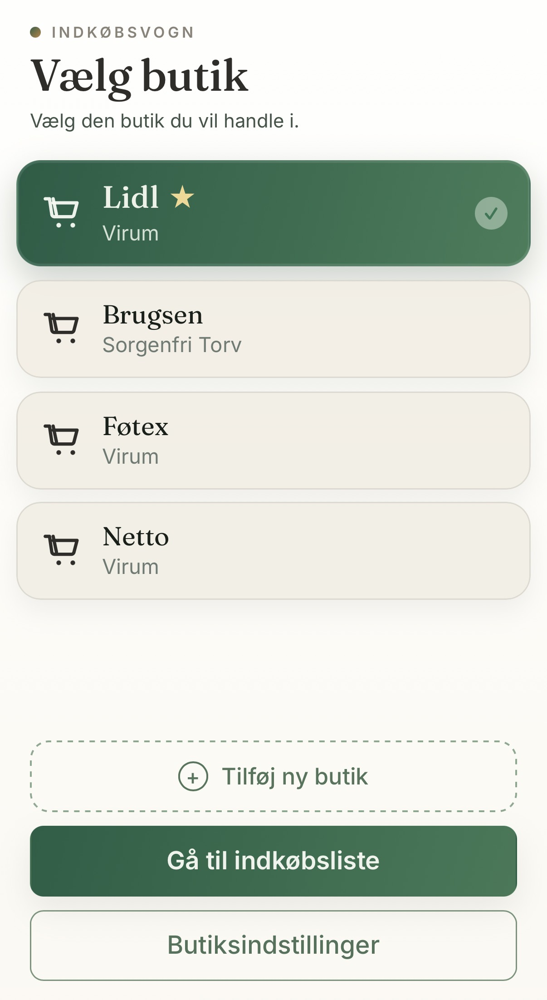

# Indkøbsvogn

Indkøbsvogn is a Danish, local-first grocery planner that learns your route through each store. The active shopping trip stays on the phone while durable household data syncs quietly in the background.

> **Public showcase mirror.** This repository mirrors the shared application/API code from the private canonical production repository. Production Cloudflare configuration, database identifiers, deployment scripts and real environment values are intentionally omitted.

## What it does

- Store-aware planning and shopping flows
- Learns item order from completed trips
- Manual drag-and-drop ordering that is persisted and learned when the next trip starts
- Household sign-in with a 6-digit email code as the PWA-friendly primary flow, with magic links as an alternative
- Local-first active shopping lists; stores, catalog data and completed trips are the durable sync target
- Background sync with offline, pending, syncing, authorization and conflict states
- Per-store loyalty cards
- Offline-capable PWA with build-versioned service-worker caches
- Cloudflare Pages Functions / D1 API source included for reference and deployment from the private canonical repository

## Screenshots

### Store selection



## Public-repository boundary

This repo is meant to be useful for code review, learning and portfolio/reference purposes without publishing production infrastructure metadata.

Intentionally **not** included here:

- `wrangler.toml` production Pages/D1 bindings
- production database/project identifiers
- deployment scripts and production deployment workflows
- real `.dev.vars` values
- private operational metadata

The current tree should still match the canonical repository for shared runtime behavior, API code and tests. See [Current implementation](docs/CURRENT.md) and [Public mirror notes](docs/HANDOFF.md).

## Getting started

```bash
bun install
bun run dev
```

`bun run dev` starts the **Vite frontend only** (normally on `http://localhost:5173`). This public mirror deliberately does not ship the Cloudflare Pages/D1 wiring needed to boot the complete production-style stack with one command.

For frontend work against an API, set `VITE_API_URL` to a compatible backend. For a complete local Cloudflare stack, provide your own Pages/D1 development configuration and placeholder environment values; do not reuse production identifiers.

### Environment example

Copy `.dev.vars.example` only when running the API with your own Cloudflare development setup. It contains placeholders and an explicit development-only local-sign-in switch.

## Verify the repository

```bash
bun run lint
bun run test
bun run build
```

GitHub Actions runs the same verification on pull requests and on pushes to `main`.

## Architecture

```text
src/
├── components/       UI screens, auth UI, sync/conflict status
├── auth/             session bootstrap and PWA login draft
├── domain/           models, migrations, route learning, manual ordering
├── sync/             local-first background sync engine
├── api/              typed browser API client
└── hooks/            local app-state integration

api/
├── src/routes/       auth, household and state endpoints
├── src/lib/          D1 repository, auth, bootstrap and rate limiting
└── tests/            API regression tests

functions/api/        Cloudflare Pages Functions adapter
public/sw.js          offline cache/service worker
```

Important implementation details include atomic verification-token consumption, real D1 affected-row handling via `meta.changes`, recoverable database bootstrap, retry/backoff for sync, preservation of edits made while a push is in flight, and a manual conflict fallback after repeated automatic conflicts.

## Documentation

- [Current implementation](docs/CURRENT.md) — what the mirrored code currently does
- [Handoff / public mirror notes](docs/HANDOFF.md) — repository boundaries and contributor workflow
- [Verification tasks](docs/tasks.md) — remaining real-device/browser checks
- [Product strategy](docs/STRATEGY.md)
- [V2 reference architecture](docs/PLAN_V2.md)

## Canonical vs. public

The private `Madmanden/indkobsvogn-private` repository is canonical. A change to shared runtime/API code there makes this mirror stale until it has been synchronized, reviewed for sanitization and passed `lint + test + build` here.
